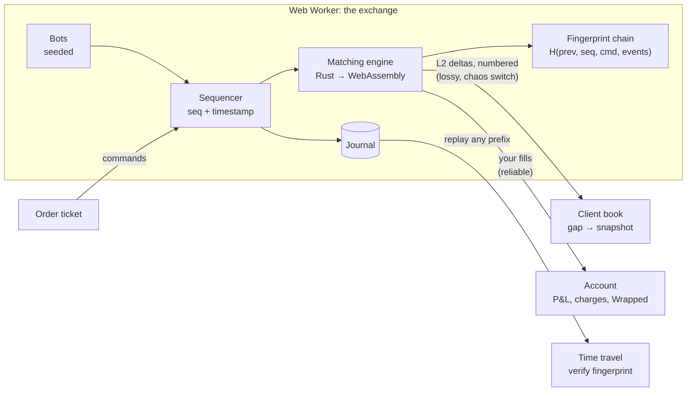

# Arena

**A stock exchange you can play, replay and audit, in your browser.**

Trade index futures against a market of bots. Watch your order wait in the queue, pay the spread and real Indian charges, then rewind the whole exchange and verify every order.

| | |
|---|---|
| **Live** | https://vikaspal1704.github.io/arena/ |
| **Engine** | Rust, no dependencies, compiled to a 79 KB WebAssembly module with no JavaScript glue |
| **Speed** | ~2 million orders/s, p50 ≈ 350 ns per order (native, one core); about the same in the browser ([benchmarks](docs/BENCHMARKS.md)) |
| **Correctness** | Differential-tested against an independent Python engine on 1.5 million random commands in CI |
| **Stack** | Rust · WebAssembly · TypeScript · React · Web Workers · Vite · Vitest · Playwright |
| **License** | [MIT](LICENSE) |

Built by **Vikas Pal** (Software Engineer, Fintech). Arena brings together three earlier projects: [mini-matching-engine](https://github.com/vikaspal1704/mini-matching-engine) (the matching rules, now the reference implementation), [live-orderbook-feed](https://github.com/vikaspal1704/live-orderbook-feed) (the market-data protocol) and [F&O Wrapped](https://github.com/vikaspal1704/fo-wrapped) (post-trade analytics and the Indian charges table).

---

## Try it in 60 seconds

1. Open the [live demo](https://vikaspal1704.github.io/arena/) and press **Start trading**.
2. Buy one lot at market. You pay the spread, and the **Position** panel shows what the charges already cost you.
3. Click a price in the book to place a limit order, then watch **Your orders** count down the queue ahead of you.
4. Under the hood, drag **Chaos** to 30%: packets are dropped, the client detects the gaps and heals from snapshots.
5. Press **Pause and time-travel** and drag the slider. The exchange is rebuilt from its journal at that point, and the fingerprint is checked against the one recorded live.
6. Press **Run 1M commands** to benchmark the engine in your own browser.
7. **End session** for your session, Wrapped: net P&L after charges, win rate, how your fills compared with the hidden fair value, and a verified audit trail.

`?seed=123` replays the same market: the bots make exactly the same moves until you trade differently.

---

## How it works



- **Matching engine** (`crates/engine`): price-time priority, limit / market (IOC) / cancel, integer prices, lazy cancels (a cancelled order becomes a tombstone that matching skips, so a cancel costs O(log n), not a queue scan). No floats, clocks or hash-map iteration anywhere, so results are byte-for-byte reproducible.
- **Sequencer and journal** (`exchange.rs`): every command gets a sequence number and is journalled before it is applied. State is a pure function of the journal, and a chained fingerprint after each command lets anyone verify a replay at every step.
- **Bots** (`sim.rs`): a market maker that skews its quotes against inventory, noise traders, and a momentum trader, all around a hidden fair value that drifts and occasionally jumps. They go through the sequencer like anyone else, so replaying needs no bot logic.
- **WebAssembly** (`crates/wasm`): plain exported functions; results are written to a buffer in module memory that TypeScript reads directly. Native and WebAssembly builds produce the same fingerprint (checked in CI).
- **Two channels**, like a real venue: market data is a numbered, lossy stream of deltas with gap detection and snapshot recovery; the player's own order events use a reliable private channel.
- **Session Wrapped** (`web/src/core/session.ts`): FIFO round trips, charges from F&O Wrapped's dated rate table, and edge against fair value.

Design decisions and trade-offs: [`docs/ARCHITECTURE.md`](docs/ARCHITECTURE.md).

---

## Proof, not claims

| Claim | How it is checked |
|-------|-------------------|
| The matching rules are right | `difftest/`: seeded random streams (limits, markets, cancels, invalid input) run through this engine and [mini-matching-engine](https://github.com/vikaspal1704/mini-matching-engine); order ids, every trade, every rejection, remaining quantities and the whole book must match after **every** command. 300 seeds × 5,000 commands (1.5 million commands, 962,740 trades) in CI. A deliberately broken engine is caught at command 20. |
| The book never goes wrong | `check_invariants` after every command in 200,000 random commands: never crossed, no empty levels, level totals equal live orders, FIFO order kept. |
| Replays are exact | Every prefix of a 3,000-step session replays to the recorded fingerprint; changing one command changes every later fingerprint. The browser checks this on demand. |
| It is deterministic everywhere | Same seed → same fingerprint natively, in WebAssembly (Node), and in two separate browser pages (Playwright). |
| The feed heals | Under 20% packet loss, the client book rebuilt from deltas and snapshots ends identical to the engine's book. |
| Nothing leaves the browser | Playwright asserts zero third-party requests; the page's CSP allows only its own origin. |

Full list: [`docs/TEST_PLAN.md`](docs/TEST_PLAN.md).

---

## Run it

```bash
# Engine: tests, benchmark, differential test
cargo test --release
cargo run --release -p arena-bench -- 2000000
pip install git+https://github.com/vikaspal1704/mini-matching-engine
cargo build --release -p arena-difftest && python difftest/compare.py --seeds 1-20 --count 5000

# Web app (needs the wasm32 target: rustup target add wasm32-unknown-unknown)
cd web
npm ci
npm run dev        # builds the engine to WebAssembly, then starts Vite
npm test           # core tests against the real WebAssembly build
npm run build && npm run test:e2e
```

## Layout

```
crates/engine/     # matching engine, sequencer, journal, fingerprint, bots (no dependencies)
crates/wasm/       # WebAssembly exports (no wasm-bindgen)
crates/bench/      # throughput and latency percentiles
crates/difftest/   # emits a random command stream and this engine's results
difftest/          # compares them with the Python reference engine
web/src/core/      # pure TypeScript: wasm wrapper, feed protocol, account, charges
web/src/worker/    # the exchange process and the benchmark worker
web/src/app/       # trading desk, under-the-hood panels, Wrapped
docs/              # PRD, architecture, test plan, benchmarks, roadmap
```

## What it is not

A simulated market with play money. Bots are simple by design; the fair value is a random walk, not a model of NIFTY. Not investment advice.
